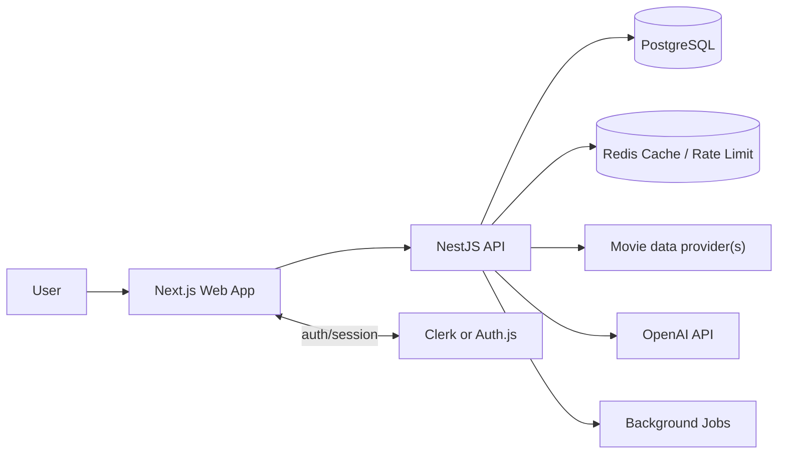

# Phase 1 Requirements: AI Movie Research Platform

## 1. Product Goal

Build a full-stack SaaS that lets users search movies and get structured AI-powered insights that help them understand a film fast:

- What the movie is about
- How characters relate to each other
- What happens in the ending
- How the story unfolds over time
- Which movies feel similar

The product should feel like a premium research tool, not a generic movie catalog.

## 2. Phase 1 Scope

### In Scope

- Movie database search and detail pages using Wikidata + Wikimedia Commons as the public baseline
- AI-generated summaries
- Character relationship maps
- Ending explanations
- Timeline analysis
- Similar movie recommendations
- Watchlist management
- Ratings and reviews
- Spoiler toggle for all spoiler-sensitive AI content
- Free usage limits per day
- Lightweight ad placements for free users
- Premium AI analysis access
- Export notes
- Unlimited collections for premium users
- Authentication and account management
- Caching and rate limiting

### Out of Scope For Phase 1

- Mobile native apps
- Social feeds and follows
- User-generated image uploads
- Video playback or hosting
- Custom model training
- Multi-language support
- Advanced moderation workflows
- Complex team or enterprise billing

## 3. Target Users

- Casual movie fans who want fast context before watching
- Rewatchers who want to understand plot details or the ending
- Film students and reviewers who want structured notes
- Power users who build watchlists and collections

## 4. Primary User Journeys

1. User signs up and searches for a movie.
2. User opens a movie page and sees basic metadata from the configured movie data source.
3. User requests AI insights with spoilers on or off.
4. User saves the movie to a watchlist or collection.
5. User rates or reviews the movie.
6. Free users hit their daily search or AI limits and are prompted to upgrade.
7. Premium users export notes and create unlimited collections.
8. Free users may see non-blocking ads that stay out of the core research flow.

## 5. Functional Requirements

### 5.1 Authentication and Accounts

- Users must be able to sign up, sign in, and sign out.
- The app must support a provider abstraction so the implementation can use Clerk or Auth.js without changing product behavior.
- Each user account must store:
  - Display name
  - Email
  - Avatar or profile image
  - Subscription status
  - Usage counters
  - Saved collections

### 5.2 Movie Search and Discovery

- Users must be able to search movies by title.
- Search should support filters such as year, genre, and language when available from the configured movie data source.
- Search results should show:
  - Poster
  - Title
  - Release year
  - Rating
  - Short overview
- Search queries should be cached to reduce upstream requests.
- The production data source must support commercial use.
- The app should use a provider abstraction so the movie data source can be swapped without changing the UI contract.
- Public baseline should use Wikidata for structured metadata and Wikimedia Commons for reusable media.
- The system should be able to add a commercial metadata provider later without rewriting the UI contract.
- If a source has coverage gaps, the UI should degrade gracefully rather than blocking search.
- Movie detail pages must be SEO-friendly.

### 5.3 Movie Detail Page

- Each movie page must show:
  - Title
  - Poster/backdrop
  - Release date
  - Runtime
  - Genres
  - Cast
  - Crew
  - External rating, if available
  - Overview
- The page must clearly separate plain metadata from AI insights.
- The spoiler toggle must control spoiler-sensitive content across the page.

### 5.4 AI Insights

AI analysis should be structured and reusable rather than a single long paragraph.

Required insight types:

- Summary
- Character relationship map
- Ending explanation
- Timeline analysis
- Similar movie recommendations

Behavior requirements:

- Spoiler mode off should hide or soften ending details.
- Spoiler mode on should allow full explanation.
- AI outputs should be stored so the same analysis can be reused.
- If cached analysis exists for the same movie and spoiler setting, return it before generating a new one.
- Responses should be delivered in a structured format that can be rendered into cards, lists, and graph data.

### 5.5 Character Relationship Maps

- The system must identify major characters and their relationships.
- Relationships should support a graph model:
  - Node: character
  - Edge: relationship type
- The UI must be able to render the map visually.
- The backend should expose normalized relationship data, not just text.

### 5.6 Timeline Analysis

- The system must summarize the story in chronological order.
- Timeline events should be structured as discrete items.
- Each event should include:
  - Approximate time or sequence order
  - Event summary
  - Optional character references

### 5.7 Similar Movie Recommendations

- The product should recommend similar titles using a combination of Wikidata metadata, Commons-linked media context, and AI ranking.
- Recommendations should include a short reason for similarity.
- Similarity should consider genre, tone, themes, cast, and storyline patterns where available.

### 5.8 Watchlist and Collections

- Users must be able to save movies to a watchlist.
- Users must be able to organize saved movies into collections.
- Premium users must have unlimited collections.
- Free users can have a limited number of collections if needed for monetization control.

### 5.9 Ratings and Reviews

- Users must be able to rate movies.
- Users must be able to write text reviews.
- Ratings and reviews must be associated with a user and a movie.
- The system should display aggregated ratings where possible.
- Basic moderation hooks should exist even if moderation UI is deferred.

### 5.10 Usage Limits and Monetization

Free tier:

- Limited number of searches per day
- Limited AI analysis usage
- Ad-supported experience with restrained, native placements

Premium tier:

- Higher or unlimited AI analysis usage
- Export notes
- Unlimited collections
- Ad-free experience

System requirements:

- Usage limits must be enforced on the backend, not only in the UI.
- The app must track per-user daily counters.
- Premium status must be checked on every billable or quota-controlled request.
- Ads must be disabled for premium users.
- Ads must not block search, reading, spoiler toggling, or AI insight loading.

### 5.11 Ads for Free Users

- Ads should be native and clearly labeled as sponsored content.
- Ads should appear in low-friction zones such as search result side rails, list feed breaks, or footer cards.
- Ads should not appear inside the main answer area of AI summaries, timeline analysis, or relationship maps.
- Ads should not use autoplay audio, forced video, modal interruptions, or full-screen interstitials.
- Ads should preserve layout stability and avoid content jumps.
- The UI should frequency-cap ads so the same user does not see repetitive placements on every screen.
- If an ad fails to load, the page should continue normally without a broken layout.
- Premium users should not see ads anywhere in the product.

### 5.12 Export Notes

- Users must be able to export their saved notes or analyses.
- Exported content should preserve structure and readability.
- The export format should be machine-friendly first, with a presentation-friendly option later if needed.

### 5.13 Admin and Operational Needs

- The system should support internal inspection of:
  - Usage counts
  - Failed AI requests
  - Movie data provider failures
  - Subscription state
- Admin UI can be minimal in phase 1, but the data model should support it.

## 6. Non-Functional Requirements

- Performance: cache movie source and AI results where possible.
- Reliability: degrade gracefully if the movie data source or OpenAI is unavailable.
- Security: keep API keys server-side only.
- Privacy: do not expose raw provider tokens to the client.
- Scalability: separate web and API concerns cleanly.
- Accessibility: keyboard navigation, proper contrast, semantic headings, and readable controls.
- Observability: log AI and movie data source failures, cache hits, and quota denials.
- SEO: movie pages and landing pages should be indexable.

## 7. Design Direction

### Visual Concept

The interface should feel like a cinematic research desk:

- Dark editorial base
- One strong accent color for actions
- Clean card hierarchy
- Poster-first layouts
- High-contrast data presentation

Suggested visual language:

- Background: charcoal or deep slate
- Accent: amber or teal
- Typography: a distinctive display face for headings paired with a clean sans for body text
- Motion: subtle fades, staggered card entrances, and gentle map/timeline transitions

### Information Hierarchy

The app should prioritize:

1. Search bar
2. Movie identity
3. AI insights
4. Structured visual data
5. Secondary metadata and community signals

### Core Screens

- Marketing landing page
- Auth pages
- Search results page
- Movie detail page
- Watchlist page
- Collections page
- Reviews and ratings area
- Billing and usage page
- Sponsored placements embedded in non-critical slots
- Minimal admin/ops view

### Interaction Rules

- The spoiler toggle must be visible before AI analysis starts.
- AI insights should load progressively, not all at once.
- Long text should collapse into readable sections.
- Relationship maps and timelines should have loading, empty, and error states.

## 8. Recommended Architecture

### High-Level System



### Service Boundaries

- Next.js: UI, routing, server components where helpful, and user-facing state
- NestJS: business logic, API orchestration, auth guards, quota checks, and provider adapters
- PostgreSQL: source of truth for users, movies, analyses, lists, reviews, and subscriptions
- Redis: caching, rate limiting, and job coordination
- OpenAI: structured analysis generation
- Wikidata + Wikimedia Commons: source movie metadata, identities, and reusable media

## 9. Core Data Model

### Primary Entities

- User
- Subscription
- UsageEvent
- Movie
- MovieCache
- AnalysisRequest
- AnalysisResult
- Character
- RelationshipEdge
- TimelineEvent
- Watchlist
- Collection
- Review
- Rating
- ExportJob

### Relationship Summary

- A user has many watchlists, collections, reviews, ratings, analysis requests, and export jobs.
- A movie has many analyses, reviews, ratings, characters, and timeline events.
- An analysis request produces one structured analysis result.
- A collection contains many movies.

## 10. Proposed Folder and File Structure

Recommended approach: a monorepo with a web app, API service, shared packages, and database schema.

```text
.
├── apps
│   ├── web
│   │   ├── app
│   │   │   ├── (marketing)
│   │   │   │   ├── page.tsx
│   │   │   │   └── layout.tsx
│   │   │   ├── (auth)
│   │   │   │   ├── sign-in
│   │   │   │   └── sign-up
│   │   │   ├── (app)
│   │   │   │   ├── search
│   │   │   │   ├── movies
│   │   │   │   │   └── [movieId]
│   │   │   │   ├── watchlist
│   │   │   │   ├── collections
│   │   │   │   ├── reviews
│   │   │   │   ├── billing
│   │   │   │   └── settings
│   │   │   ├── api
│   │   │   │   └── health
│   │   │   ├── layout.tsx
│   │   │   └── globals.css
│   │   ├── components
│   │   │   ├── ui
│   │   │   ├── layout
│   │   │   └── shared
│   │   ├── features
│   │   │   ├── search
│   │   │   ├── movie-detail
│   │   │   ├── watchlist
│   │   │   ├── collections
│   │   │   ├── reviews
│   │   │   ├── billing
│   │   │   └── analytics
│   │   ├── lib
│   │   │   ├── api-client.ts
│   │   │   ├── auth.ts
│   │   │   ├── env.ts
│   │   │   └── utils.ts
│   │   ├── hooks
│   │   ├── types
│   │   └── public
│   └── api
│       └── src
│           ├── main.ts
│           ├── app.module.ts
│           ├── config
│           │   ├── env.ts
│           │   └── validation.ts
│           ├── common
│           │   ├── guards
│           │   ├── interceptors
│           │   ├── filters
│           │   └── decorators
│           ├── modules
│           │   ├── auth
│           │   │   ├── auth.module.ts
│           │   │   ├── auth.controller.ts
│           │   │   └── auth.service.ts
│           │   ├── users
│           │   ├── movies
│           │   │   ├── movies.module.ts
│           │   │   ├── movies.controller.ts
│           │   │   ├── movies.service.ts
│           │   │   └── dto
│           │   ├── movie-data
│           │   ├── ai
│           │   │   ├── ai.module.ts
│           │   │   ├── ai.controller.ts
│           │   │   ├── ai.service.ts
│           │   │   └── prompts
│           │   ├── watchlist
│           │   ├── collections
│           │   ├── reviews
│           │   ├── ratings
│           │   ├── subscriptions
│           │   ├── usage
│           │   └── exports
│           ├── jobs
│           └── test
├── packages
│   ├── db
│   │   └── prisma
│   │       ├── schema.prisma
│   │       ├── migrations
│   │       └── seed.ts
│   ├── shared
│   │   ├── types
│   │   ├── schemas
│   │   └── constants
│   └── ui
│       ├── components
│       └── styles
├── docs
├── scripts
├── infra
├── .env.example
├── package.json
└── turbo.json
```

### Key Files to Define Early

- `packages/db/prisma/schema.prisma`: core data model
- `apps/api/src/modules/ai/ai.service.ts`: prompt assembly, OpenAI calls, and caching
- `apps/api/src/modules/movies/movies.service.ts`: movie data provider access and movie enrichment
- `apps/api/src/modules/usage/usage.service.ts`: quotas and rate limits
- `apps/web/app/(app)/movies/[movieId]/page.tsx`: movie research page
- `apps/web/components/ui/*`: design system primitives
- `apps/web/lib/api-client.ts`: API communication and error normalization
- `apps/web/lib/auth.ts`: auth provider integration

## 11. Phase 1 Acceptance Criteria

- Users can search for movies and open a movie detail page.
- Movie metadata loads from the configured movie data source and is cached.
- Users can request AI summaries with spoiler control.
- Relationship maps, timeline analysis, and similar movie suggestions render from structured data.
- Users can sign in and maintain a watchlist.
- Users can rate and review movies.
- Free usage limits are enforced on the backend.
- Free users see ads only in non-blocking, clearly labeled placements.
- The movie data baseline is commercial-safe and can be swapped without rewriting the app.
- Premium flags unlock analysis, export, and unlimited collections.
- The codebase follows the proposed folder structure and service boundaries.

## 12. Open Questions to Resolve Before Implementation

- Should the auth provider be Clerk, Auth.js, or both behind an abstraction?
- Which commercial metadata provider, if any, should supplement Wikidata + Commons later?
- What exact free-tier quota should apply per day?
- What export formats are required for phase 1?
- Will premium billing be Stripe from day one?
- Should reviews be public or private by default?
- Do we want per-user collections at launch or a shared watchlist only?
